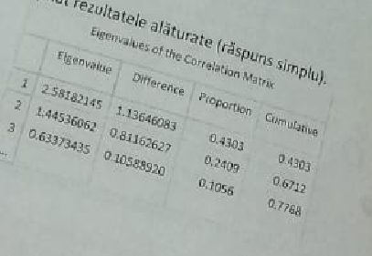

## Tableau

#### t1)(18) Pentru identificarea factorilor ce contribuie la satisfactia clientilor unei companii de transport aerian, a fost realizata o regresie logistica, obtinandu-se urmatoarele rezultate(raspuns multiplu):

    **correct**   a) Femeile au o porbabilitate mai mare de a fi satisfacute cu privire la calatoria cu avionul decat barbatii
                  b) Femeile au o probabilitate mai mica de a fi satsifactue cu privire la calatoria cu avionul decat barbatii
    **correct**   c) Cu cat suportul online este mai bun cu atat clientul are o probabilitate mai mare de a fi satisfacut  cu privire la calatoria cu avionul
                  d) cei care considera ca suportul online nu este deloc bun (ONline Support = 0) au probabilitatea de fi satisfacuti cu privire la calatoria cu avionul mai mica decat cei care considera ca suportul online este foarte bun (Online support = 5)

#### t2)(19) Care dintre cele de mai jos nu reprezinta o situatie de evitat in realizarea dashboard-urilor (raspuns simplu):

     a) includerea datelor care nu sunt de actualitate in graficele componente ale dashboardului.
    b) includerea a cat mai multa informatie in dashboard, realizarea unui dashboard complex utilizand toti indicatorii aflati la dispozitie
     c) utilizarea in dashboard a cat mai multe elemente stilizate
    **correct** d) sincronizarea intre indicatorii inclusi in dashboard si obiective.

#### t3)(20) Pentru identificarea factorilor ce contribuie la satisfactia clientilor unei companii de transport aerian, a fost realizate o analiza SAS, obtinandu se urmatoarele rezultate (raspuns multiplu):

     **correct** a) A fost folosit Modelul Tree (Arbore de Decizie)
    b) A fost folosit Modelul de regresie Logistica
     **correct** c) varianta ce mai importanta este Inflight Entertainment
    **correct** d)Variabilele cele mai importante sunt: Inflight Entertainment si Seat Comfort

#### t4)(21) O legatura de tipul "Right Join" in Tableau: (raspuns simplu)

     a)Pastreaza informatiile prezenta in ambele tabele, doar pentru inregistrarile comune in ambele tabele
     **correct** b)Pastreaza toate datele din tabela din dreapta si adauga informatii din table din stanga
     c)Pastreaza toate datele din tabela din stanga si adauga informatii din table din dreapta
     d)adauga informatii din amebele tabele

#### t5)(22) Ce elemente enumerate mai jos reprezinta atribute utilizate in perceptia vizuala (raspuns simplu)

    **correct** a)Forma
    b)Filtrele
    **correct** c)Orientarea
    **correct** d)Culoarea

#### t6)(23) Urmatoarele reprezentari vizuale sunt utile in identificare valorilor extreme:(raspuns multiplu)

    **correct** a)Box Plot
    **correct** b)Control Chart
    c)Pie Chart
    **correct** d)Scatter Plot (diagram norului de puncte)

#### t7)(24) Cvartetul Anscombe a aratat ca (raspuns multiplu)

    a)Statisticile descriptive sunt suficiente pentru a realiza analiza exploratorie a datelor
    b)Corelatia inseamna cauzalitate
    **correct** c)Vizualizarea completeaza utilizare indicatorilor statistici in caracterizarea initiala a datelor
    d)Vizualizarile sunt mai importante decat indicatorii statistici descriptivi si sunt suficiente in faza incipienta de analiza a datelor.

#### t8)(12) Realizati corespondenta intre urmatoarele seturi de date si reprezentarile grafice adecvate:

    1)Rata lunara a somajului in Romania pentru ultimii 10 ani
    2)Speranta de viata in taile UE pentru 2018
    3)Salariul Mediu in cele 8 departamente ale unei companii in anul 2019
    4)Dsitributia anagajatilor unei companii pe grupe de varsta
    5.Preferintele alegatorilor dintr un oras pentru 3 candidati la alegerile pentru Primarie

    A)Grafic de tip
    B)Histograma
    C)Grafic de tip harta
    D)Grafic de tip
    E)Pie Chart

    Corect d)  1-D, 2-C,3-A,4-B,5-E,

#### t9) (13) In cazul modelelor de clusterizare(raspuns simplu):

      a) Daca partile cu un numar mic de clase sunt foarte diferite intre ele, atunci este posibil ca multimea indivizilor sa nu poat fi impartita in clase.
     **correct** b) Daca partile cu un numar mare de clase sunt foarte diferite intre ele, atunci este posbili ca multimea variabilele sa nu poate fi impartita in clase.
      c) Daca partile cu un numar mare de clase sunt foarte diferite intre ele, atunci este posibil ca multimea variabilelor sa nu poate fi impartita in clase.
      d) Nici unul din raspunsurile anterioare.

#### t10) (14) Desi graficele de tip 'pie-chart' sunt controversate si este recomandabil sa fie evitate, exista multi utilizatori care le folosesc totusi. Care este situatia in care graficul de tip pie-chart nu trebuie utilizat (raspuns simplu)

     a) Reprezentarea vizuala a relatie parte la intreg
     **correct** b) Compararea a mai mult de 5 categorii
     c) Prezentarea unei reprezentari simple si familiare audientei
     d) Expunerea optiunilor de vot pentru 2 partide politice

#### t11) (15) Care dintre urmatoarele situatii nu reprezinta incalcarea principiilor esentiale de design ale repzentarilor vizuale (raspuns simplu)

     **correct** a) Omiterea axei OX atunci cand sunt incluse etichetele
     b) Utilizarea vizualizarilor 3D
     c) Culori diferite pentru fiecare element inclus in grafic
     d) Niciuna din cele de mai sus

#### t12) (16) (poza) In urma aplicarii Analizei in Componente Principale s au obtinut rezultatele alaturate(raspuns simplu).

     a)A doua componenta principala explica 67.12% din variabilitatea totala
     **correct** b)Conform criteriului Kaiser se vor pastra in analiza 2 componente principale
     c)Conform criteriului Kaiser se vor pastra in analiza 3 componente principale
     d)Niciuna din afirmatiile de mai sus nu este adevarata.
     

#### t13) (17) Analiza inteligenta a datelor (AID) este .. (raspuns multiplu)

    **correct**  a)Analiza eficienta a datelor
    **correct**  b)Utilizate pentru a extrage informatii utile din cantitati mari de date online
     **correct** c)extragerea de cunostinte dezirabile sau modele interesante din bazele de date existente
    d)Nici una din afirmatiile de mai sus

#### t14) (18) Urmatoarele nu reprezinta elemente de estetica in reprezentarile vizuale (raspuns simplu)

     **correct** a) includerea tuturor elementelor in vizualizare astfel incat sa nu mai ramana spatiu alb neutilizat
     b) Utilizarea strategica a culorii
      **correct** c) alinierea elementelor in grafic
     d)niciuna din cele de mai sus

#### t15) (19) Functionalitatea "Too tip" in tableau(raspuns simplu)

     a) Ofera utilizatorului posibilitatea de a adauga grafice suplimentare
     b) Ghideaza utilizatorul in alegerea celui mai bun grafic pentru setul de date folosit
     c) Permite filtrarea datelor in functie de un anumit camp
     **correct** d) Ofera interactivitate prin afisarea de informatii suplimentare

#### t16) (20) Fereastra de dialog de mai jos din Tableau are ca efect:

       **correct** a)Crearea unui camp calculat cu valor intregi ce poate fi utilizata ca filtru
      b)Crearea unui parametru care poate lua orice valoare intre 1 si 5
       **correct** c)Crearea unui filtru care permite selectarea valorilor 1,2,3,4,5
      **correct**  d)Crearea unui parametru care poate lua doar valorile 1,2 3,4,5

#### t17) (21): Intr un grafic sut vizualizati angajatii care au salariu lunar mai mare de 4000. Directrorul doreste sa aiba posibilitatea modificarii pragului de 4000 astfel incat sa vizualizeze rapid angajatii cu salariu peste 5000, 6000, 7000. Pentru a asigura aceasta functionalitate in Tableau se paote utiliza(r. simplu)

      a)actiune
       **correct** b)un parametru
      c)camp calculat
      d)instrumentul tool tip

#### t18) (22): In tableau actiunile:(raspuns multiplu)

     a)Pot fi de tip filtru
     **correct** b) se utilizeaza in dashboard pentru a asigura corelarea informatiilor
     c)pot fi de tip Parametru
     **correct** d)Pot fi utilizate pentru a crea linkuri catre pagini Web

#### t19) (23) IF cu vanzarile
if sum(Vanzari) <  100 000 then 'Vanzari sub limita'
elseif sum(Vanzari) < 150 000 then 'vanzari in limita' else 'vanzari peste limita'

      **correct** a) Se creeaza un parametru nou care defineste un prag dinmaic al vanzarilor
      **correct** b)vanzarile peste 150 000 sunt considerate peste limita
     c)se creeaza o nou avariabila de tip continuu care poate fi utilizata pentru marcarea de tip culoare.
      **correct** d)vanzarile peste 100 000 sunt considerate peste limita